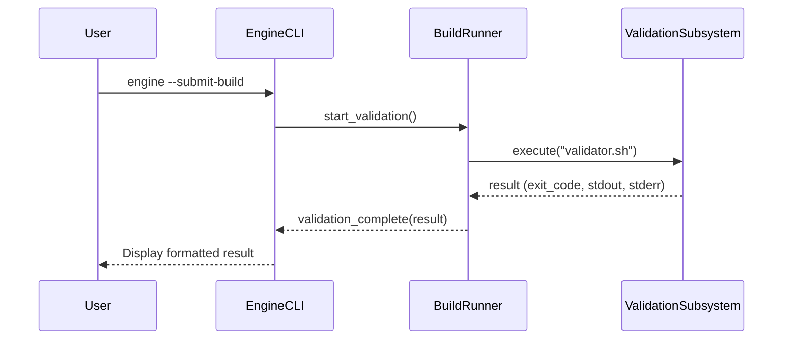

---

### **Technical Blueprint: The Mastery Engine**
**Version:** 5.0 (Comprehensive Synthesis)
**Status:** Finalized Design

#### **1. Introduction: The Guiding Philosophy**

The Mastery Engine is a sophisticated pedagogical framework designed to solve a fundamental problem in technical education: the persistent gap between theoretical knowledge and resilient, real-world skill. Traditional educational models often produce practitioners who can replicate known solutions but lack the first-principles understanding required to innovate, justify design choices, or debug novel problems.

The engine's philosophy is that true mastery is not achieved through passive consumption but through an active, iterative cycle of creation, articulation, and problem-solving. It is not a content delivery platform; it is a "cognitive gym" for developing the universal skills of a professional engineer, scientist, or strategist.

#### **2. The Core Pedagogy: The "Build, Justify, Harden" Loop**

The entire system is founded upon a universal, three-stage learning loop applied to discrete modules of knowledge.

1.  **Build (Implementation Proficiency):** The user is challenged to translate a formal specification into a concrete artifact from a blank slate. This stage tests the ability to convert theory into practice. The artifact can be a piece of code (e.g., a PyTorch `nn.Module`), a formal analysis, or a written strategy.

2.  **Justify (Conceptual Understanding):** Upon a successful build, the engine interrogates the user on the *why* behind their creation. It asks targeted, Socratic questions to force the articulation of foundational principles. This is not a simple keyword check; it is powered by a **Taxonomy of Bad Justifications** (e.g., the Rote Memorizer, the Hand-Waver, the Cargo Cultist) to detect and provide corrective feedback for shallow or imprecise understanding.

3.  **Harden (Debugging and Resilience):** The engine takes the user's *own correct artifact*, programmatically injects a subtle but realistic flaw, and presents the resulting symptom. The user must then diagnose and fix the bug in their own work. This stage simulates the most critical real-world engineering skill: debugging under uncertainty.

#### **3. System Architecture: An Evolutionary Blueprint**

The Mastery Engine's architecture is best understood as an evolutionary stack, where each layer adds a significant new capability to solve a previously identified limitation. This layered design creates a system that is modular, intelligent, and deeply aware of its subject matter.

```
+-------------------------------------------------------------+
|   Layer 5: Collaborative Ecosystem (CI/CD & Novelty Engine)  |
+-------------------------------------------------------------+
|   Layer 4: Live Execution Engine (Dynamic Runtime Analysis)   |
+-------------------------------------------------------------+
|   Layer 3: Semantic Engine (Automated Curriculum Generation)  |
+-------------------------------------------------------------+
|   Layer 1-2: Foundational Engine (Core Loop & Validation)     |
+-------------------------------------------------------------+
```

*   **v1: The Foundational Engine (Modular Core):** The initial design established the separation of the course-agnostic `engine/` from the pluggable `curricula/` packs. This core modularity, defined by a `manifest.json`, allows the engine to be a general-purpose platform.

*   **v2: The Sophisticated Justifier:** This evolution enhanced the `Justify` stage with the "Taxonomy of Bad Justifications," moving from simple checks to a nuanced, LLM-driven dialogue that could diagnose and correct specific flaws in a user's reasoning.

*   **v3: The Semantic Engine (Scalable Content Ingestion):** To solve the bottleneck of manual curriculum creation, this layer introduces an automated pipeline. It uses an LLM to parse unstructured text (papers, books), extract a **Knowledge Graph (KG)** of concepts and relationships, and dynamically generate the Build prompts, Justify questions, and Harden challenges.

*   **v4: The Live Execution Engine (Dynamic Code Analysis):** For software engineering curricula, this layer adds a crucial capability: the engine doesn't just read the code, it **runs it**. By capturing a detailed execution trace, it can fuse static analysis (the code itself) with dynamic analysis (its runtime behavior). This enables challenges that require correlating formulas to runtime values or diagnosing runtime bugs (e.g., `NaN` explosions, memory leaks) that are invisible in the static code.

*   **v5: The Collaborative Ecosystem (The Self-Improving Loop):** This final, meta-level layer transforms the engine from a tool into a living ecosystem. It consists of two key subsystems:
    1.  **The Collaborative Refinery:** Treats curricula like software projects with a **CI/CD pipeline** to automatically validate their quality, combined with a **user feedback loop** (`--flag-issue`) that allows the community to report errors and suggest improvements.
    2.  **The Novelty & Talent Engine:** Solves the "genius user" problem. The engine **benchmarks** user submissions for superior performance (Build stage) and **analyzes** justifications for novel insights. Exceptional submissions are flagged for human review, allowing the best user-generated solutions and ideas to be integrated back into the core curriculum, with attribution.

#### **4. The User Journey: A Practical Walkthrough**

To make this architecture concrete, consider a user tackling the `multi_head_attention` module in a CS336 curriculum.

*   **Phase 0: Upstream CI Pipeline:** Before the user begins, the curriculum pack has already been validated. The CI system has confirmed its `validator.sh` works against a reference solution and that its "bugs" correctly cause test failures.

*   **Phase 1: Build:** The user is prompted to implement the `MultiHeadSelfAttention` module from scratch. After writing the code, they submit it. The engine runs the `validator.sh`, which executes a `pytest` suite. The user iterates until all correctness tests pass. Simultaneously, the validator benchmarks the implementation's speed.

*   **Phase 2: Justify:** The engine asks a question like, "Explain the computational advantage of splitting Q, K, and V into heads before the matrix multiplication, rather than after." The user's free-form answer is evaluated by an LLM, which checks for core concepts ("parallelization," "FLOPs reduction") and ensures the reasoning is sound, not just a parroted phrase.

*   **Phase 3: Harden:** The engine copies the user's correct code and silently applies a patch that incorrectly broadcasts the causal mask. It presents the symptom: "The model's perplexity is suspiciously low, suggesting it is cheating by looking at future tokens." The user must diagnose this subtle runtime behavior and fix the masking logic in their code.

*   **Phase 4 (Potential): Novelty Detection:** The engine notes the user's `build` was 20% faster than the reference due to a clever use of `torch.jit.script`. It flags this submission. A maintainer reviews it and decides to add a note about JIT compilation to the module's "Advanced Optimizations" section, crediting the user.

#### **5. Domains of Application: The Universal Gym**

The framework's power lies in its universality. It functions as a "gym" for different domains by changing the nature of the artifacts and bugs.

| Feature | **The Engineer's Gym (CS336)** | **The Strategist's Gym (Mental Models)** |
| :--- | :--- | :--- |
| **Domain** | Software Engineering & Applied ML | Cognitive Science & Business Strategy |
| **"Build" Artifact** | A Python program (`nn.Module`) | A written plan or analysis |
| **"Build" Validation** | Objective, automated (`pytest`, benchmarks) | Heuristic, automated (`grep` for principles) |
| **"Justify" Target** | Technical rationale ("Why pre-norm?") | Conceptual rationale ("Why is retrieval effective?") |
| **"Harden" Bug** | A bug in the code (e.g., `NaN` value) | A bug in the reasoning (e.g., flawed study plan) |

#### **6. Advanced Applications: System-Level Mastery**

For users who master the core components, the engine offers capstone "Advanced Tracks" that teach holistic, system-level skills. The premier example is the **"Performance Engineering"** module:

1.  **Profile:** The user is given a complete but slow system (e.g., a BPE tokenizer) and must use a profiler to identify the primary performance bottleneck.
2.  **Hypothesize & Justify:** The user must propose a specific optimization strategy (e.g., parallelization) and justify why it will work based on computer science principles.
3.  **Optimize & Harden:** The user implements their solution, which is then validated against both correctness tests and a new, stringent performance target.

#### **7. Conclusion: A Collaborative Knowledge Refinery**

The Mastery Engine, in its final, synthesized form, is more than a teaching tool—it is a **collaborative knowledge refinery**. It creates a virtuous, self-improving cycle:
*   It **teaches** students with a robust, multi-faceted pedagogy.
*   It **validates** its own curriculum through automated quality assurance.
*   It **learns** from its community by incorporating feedback and promoting novel insights from its most talented users.

The system's ultimate function is to curate and evolve a body of knowledge through the collective effort of its community, ensuring the curriculum becomes progressively deeper, more efficient, and more robust over time. It is a living system designed not just to transmit knowledge, but to refine it.

Of course. This document synthesizes the strongest elements from all three versions into a single, definitive technical blueprint for the "Phase 0: Upstream CI Pipeline."

It combines the strategic framing of Version 1, the deep failure analysis of Version 2, and the professional-grade engineering practices of Version 3. The result is a comprehensive and verbose document that serves as the official technical specification for this critical subsystem.

---
==========
### **Technical Blueprint: The Phase 0 Upstream CI Pipeline**
**Version:** 1.0 (Comprehensive Synthesis)
**Status:** Finalized Design

#### **1. The Strategic Imperative: The Guardian of Trust**

The Phase 0 pipeline is the bedrock of the Mastery Engine's pedagogical integrity and scalability. Its primary function is to establish and enforce a **pact of trust** with the user. Every learner must operate with the core assumption that the platform is infallible; if their submission fails, the bug is in their work, not the system. Any ambiguity on this point is catastrophic, turning a powerful learning tool into a source of profound frustration.

This pipeline codifies the principle of **"Curriculum-as-Code."** Educational content is not a static document but a mission-critical software artifact. As such, it must be subjected to the same rigorous, automated Continuous Integration (CI) and validation that we would apply to production software.

The strategic goals of this pipeline are:

*   **To Guarantee Reliability:** Ensure every module is pre-validated to be correct, functional, and consistent.
*   **To Prevent Pedagogical Bugs:** Automatically detect and prevent errors in the learning materials themselves, such as broken tests, ineffective debugging challenges, or misleading prompts.
*   **To Enable Scalability & Collaboration:** Provide a robust, automated gatekeeper that allows a distributed community of curriculum designers to contribute content with confidence, enforcing a high quality bar and preventing regressions.
*   **To Ensure Reproducibility:** Eliminate all "works on my machine" issues by validating content in a standardized environment that perfectly mirrors the student's.

#### **2. System Architecture and Repository Structure**

The CI pipeline's design is reflected in the project's repository structure, which cleanly separates public curriculum content from private validation assets.

```
mastery-engine/
├── .github/
│   └── workflows/
│       └── validate_curriculum.yml  # The CI pipeline definition
│
├── curricula/                     # User-facing curriculum packs (e.g., cs336_a1/)
│   └── ...
│       └── modules/
│           └── rmsnorm/
│               ├── build_prompt.txt
│               ├── validator.sh
│               ├── justify_questions.json
│               └── bugs/
│                   ├── bug1.patch
│                   └── bug1_symptom.txt
│
└── .solutions/                    # PRIVATE reference solutions (not in user distribution)
    └── cs336_a1/
        └── modules/
            └── rmsnorm/
                └── reference_impl.py
                └── reference_impl.stdout.golden
```

*   **`.github/workflows/`:** Contains the YAML configuration for the CI service (GitHub Actions), defining the triggers and jobs for the pipeline.
*   **`.solutions/` Directory:** This parallel, private directory contains the "ground truth"—the maintainers' canonical, known-good reference implementations for every module. This directory is used exclusively by the CI pipeline and is **never** distributed to the end-user.

#### **3. The Multi-Job Validation Workflow**

The pipeline is defined in `validate_curriculum.yml` and is triggered on every `git push` or `pull_request` that modifies files within the `curricula/` directory. It is structured as a series of dependent jobs, ensuring a "fast fail" approach where cheap static checks run before expensive dynamic tests.

**Execution Environment:** Every job runs within a **containerized environment (Docker)** built from a project-specific `Dockerfile`. This guarantees a pristine, reproducible environment with the exact OS, Python version, and library dependencies (`requirements.txt`) the student will use.

---

##### **Job 1: Static Analysis & Linting (The "Hygiene Check")**

This job performs rapid, inexpensive checks to catch common structural and formatting errors.

*   **File Structure Validation:** A script recursively traverses any modified curriculum module and asserts that all required files (`manifest.json`, `validator.sh`, etc.) are present.
*   **Format Linting:** `jq` is used to validate all `.json` files. `shellcheck` is run against all `validator.sh` scripts to enforce best practices.
*   **Semantic Linting (Advanced Warning):** An LLM-powered script performs a consistency check, comparing the `build_prompt.txt` against the `justify_questions.json`. It flags potential mismatches (e.g., a question about a concept not mentioned in the prompt) as a non-blocking "warning" in the CI logs, alerting the maintainer to a potential pedagogical flaw.

---

##### **Job 2: The "Golden Path" Validation (Testing the Tests)**

This is the most critical job for establishing the "pact of trust." It validates the testing machinery itself and depends on Job 1 succeeding.

*   **Step 2.1: Validate the Validator:**
    *   **Action:** The CI runner executes the module's `validator.sh` script against the corresponding reference solution from `.solutions/`.
    *   **Assertion:** The script **MUST** exit with code `0` (success).
    *   **Failure Condition:** A non-zero exit code signifies a critical failure. The pipeline fails immediately with a clear error: `VALIDATOR FAILED: The test suite did not pass against the canonical reference solution.`

*   **Step 2.2: Validate Output Stability & Establish Performance Baseline:**
    *   **Action:** The `validator.sh` is designed to print structured output upon success (e.g., `PERFORMANCE: 1.45s`). The CI runner captures this `stdout`.
    *   **Assertion 1 (Stability):** The captured `stdout` is diffed against a committed `.golden` file. Any unexpected change to the output format or messages causes the build to fail. This prevents unintentional changes to user-facing feedback.
    *   **Assertion 2 (Baseline):** The performance metric is extracted and stored. This value becomes the official performance benchmark for this version of the curriculum, which the "Novelty & Talent Engine" will use for comparison. A dramatic deviation from the previous baseline can be flagged as a warning.

---

##### **Job 3: Harden Stage Validation (The "Meta-Test")**

This job ensures that every "Harden" challenge is a meaningful, effective, and solvable debugging task. It depends on Job 2 succeeding.

*   **Action:** The CI runner iterates through every bug defined in the `bugs/` directory. For each bug (e.g., `bug1.patch`), it performs the following meta-test:
    1.  It creates a temporary copy of the known-good reference solution.
    2.  It applies the patch file, creating a mutated, buggy version of the code.
    3.  It executes the `validator.sh` script against this **buggy version**.

*   **Primary Assertion (Guaranteed Failure):** The `validator.sh` script **MUST** exit with a non-zero code (failure).
    *   **Failure Condition (The "Silent Bug"):** If the script exits with code `0`, it means the bug was pedagogically useless—it had no effect detectable by the tests. The pipeline fails with a critical error: `HARDEN FAILED: Bug 'bug1.patch' is a "Silent Bug" and did not cause a test failure.` This prevents giving students an impossible task.

*   **Advanced Assertion (Symptom Matching):**
    *   **Action:** The CI runner captures the `stderr` output from the failed test run. It also reads the text from the corresponding `bug1_symptom.txt`.
    *   **Assertion:** It uses an LLM to check if the technical error message (e.g., "Tensor shape mismatch: expected [1024, 512], got [1024, 256]") is semantically aligned with the user-facing symptom description (e.g., "The model's output dimensions are incorrect, causing a crash in the next layer.").
    *   **Failure Condition:** A significant mismatch results in a non-blocking warning, prompting the maintainer to improve the clarity of the symptom description to better guide the student.

---

#### **4. Outputs and Impact**

*   **On Success:** The pull request receives a green checkmark and is cleared for merging. The maintainer can proceed with confidence.
*   **On Failure:** The pull request is blocked. The maintainer is notified with a link to the detailed logs, which pinpoint the exact job, step, and assertion that failed, enabling rapid diagnosis and remediation.

By implementing this professional-grade, multi-stage validation pipeline, the Mastery Engine elevates its curriculum from a simple collection of files to a highly reliable, trustworthy, and scalable software artifact. This Phase 0 process is the invisible, unforgiving quality engineer that makes the entire learning experience possible.

=====
Of course. This document synthesizes the strongest elements from the critical analysis of all three versions of the "Phase 1: Build Stage" description.

It integrates the strategic, skill-focused framing of Version 1, the deep pedagogical and technical insights of Version 2, and the powerful, feedback-centric examples of Version 3. The result is a comprehensive and verbose technical blueprint that is more complete and compelling than the sum of its parts.

---

### **Technical Blueprint: Phase 1 - The "Build" Stage**
**Version:** 1.0 (Comprehensive Synthesis)
**Status:** Finalized Design

#### **1. The Guiding Philosophy: From Consumer to Creator**

The "Build" stage is the pedagogical heart of the Mastery Engine. It is founded on the core principle of **synthesis over analysis**. We reject passive learning (reading existing code) and incremental, guided exercises (filling in templates). True, durable knowledge is not demonstrated by recognition but is forged through active, generative recall. By forcing the user to confront a blank file, this stage provides the crucible where abstract theory is hammered into tangible skill.

The strategic goals of this "blank canvas" approach are:

*   **To Enforce Intellectual Honesty:** It is impossible to hide a lack of understanding when faced with an empty file. The user must actively retrieve and synthesize concepts from memory, which immediately exposes any and all gaps in their knowledge—the "unknown unknowns." The struggle is not a sign of failure; it is the designed process of discovery.
*   **To Forge Professional-Grade Skills:** This stage directly simulates the core professional workflow of an engineer. It tests a constellation of skills that are impossible to evaluate with simpler methods:
    *   **Translation:** Converting a formal specification (prose, formulas) into the precise, unforgiving syntax of code.
    *   **Architectural Recall:** Structuring the necessary classes, methods, and data flows from memory without a scaffold.
    *   **Problem Decomposition:** Breaking a complex problem into smaller, manageable sub-components.
    *   **Tool Command:** Demonstrating fluency in the foundational tools of the trade.
*   **To Create a Personal Artifact:** The code the user writes is not a disposable submission. It becomes the **personal artifact** that forms the basis for the subsequent `Justify` and `Harden` stages. This creates a powerful sense of ownership, making the following stages deeply personal and effective, as users will be justifying and debugging *their own work*.

#### **2. The User's Journey: The Iterative Feedback Loop**

The user's journey is a structured, iterative cycle designed to turn failure into immediate, actionable learning.

**Step 1: The Prompt ("The Engineering Ticket")**
The user begins with `engine --next`. The engine presents the `build_prompt.txt`, which is framed not as a tutorial but as a **formal specification**, akin to a professional engineering ticket. It defines the "what," not the "how," by providing:
*   Required class and method signatures.
*   Input/output tensor shapes and types.
*   Key mathematical formulas and constraints.
*   The target save location: `workspace/module.py`.

**Step 2: The Implementation ("Confronting the Void")**
The user opens their editor and begins implementation. They must translate the abstract specification into working code, drawing solely on their own understanding. This is where they grapple with the core challenges of the module.

**Step 3: The Submission & Feedback Cycle ("The Moment of Truth")**
When ready, the user runs `engine --submit-build`. This initiates the validation process and the crucial feedback loop.

*   **On Failure:** The engine provides immediate, specific, and actionable feedback. The user iterates on their code using this feedback.
*   **On Success:** The engine displays a clear success message, including the results from the benchmark. It automatically updates the user's progress file and proceeds to the "Justify" stage.

#### **3. The Art of Feedback: The Engine's Differentiator**

The quality of feedback is what separates the Mastery Engine from a frustrating autograder. The feedback is designed to be a powerful learning tool in itself.

**Bad Feedback (A Simple Autograder):**
```
> [ENGINE] Tests Failed. Your code is incorrect. (Exit code 1)
```
This is useless. It confirms failure but provides no path to success.

**High-Fidelity Feedback (The Mastery Engine):**
```
> [ENGINE] Validation failed. See details from pytest below:
=========================== FAILURES ===========================
________________ test_mha_output_shape _________________

    def test_mha_output_shape():
        model = MultiHeadSelfAttention(...)
        x = torch.randn(32, 64, 512) # (B, T, D)
        output = model(x)
>       assert output.shape == (32, 64, 512)
E       AssertionError: assert torch.Size([32, 64, 8, 64]) == (32, 64, 512)
E         Left-hand side has shape torch.Size([32, 64, 8, 64]).
E         Right-hand side has shape (32, 64, 512).

tests/test_mha.py:42: AssertionError
```
This is a professional-grade debugging experience. The user sees the exact, unabridged traceback, the assertion that failed, and the variable diffs. They can immediately form a hypothesis ("I forgot to concatenate the heads and apply the final projection") and take action. This respects the user's intelligence and teaches the critical skill of interpreting complex error messages.

#### **4. Engine Internals: The "Adapter & Hook" Model**

The engine's backend is robust, secure, and non-intrusive. It executes the following workflow upon submission:

1.  **Dynamic Scaffolding (The "Adapter"):** The test suite needs to import the user's code without being tightly coupled to their workspace. The engine achieves this by dynamically generating a temporary **adapter file** (or "hook"). This file's sole purpose is to import the user's class, bridging the gap to the official test suite.
    ```python
    # temp/adapter_hook.py (Auto-generated by the engine)
    from workspace.mha import MultiHeadSelfAttention
    ```
2.  **Subprocess Execution:** The engine invokes the module's `validator.sh` script in an isolated shell process using `subprocess.run()`, capturing `stdout`, `stderr`, and the exit code.

3.  **Result Parsing:** The engine first checks the **exit code**. If non-zero, it presents the captured `stderr` to the user. If zero, it parses the captured `stdout` using a regular expression to extract the structured performance metric (e.g., `PERFORMANCE: 87ms`).

#### **5. Anatomy of a Well-Designed `validator.sh`**

The `validator.sh` script is a critical curriculum artifact with a clear contract of responsibilities:

*   **Responsibility 1: Execute Correctness Tests:** Its primary job is to run the test suite (e.g., `uv run pytest`). The tests must be scoped to *only* the current module to keep the feedback loop fast.
*   **Responsibility 2: Execute Benchmarks Conditionally:** It must only run performance tests *after* all correctness tests have passed. A simple `if [ $? -eq 0 ]; then ...` block is used to enforce this.
*   **Responsibility 3: Provide Structured, Machine-Readable Output:** Upon success, it must print performance results in a simple, parsable format that the engine's backend can reliably consume.
*   **Responsibility 4: Preserve High-Fidelity Feedback:** It must not suppress, alter, or "dumb down" the raw output from the underlying test framework. The rich, detailed traceback is the most valuable data for the learning user.

#### **6. Strategic Impact: Skills Forged in the Crucible**

A well-executed "Build" stage teaches a confluence of skills that transcend the module's specific topic. By the end of this stage, the user has not only proven their competence but has also practiced:

*   **Test-Driven Mindset:** The core loop of writing code to satisfy a specific, failing test.
*   **Systematic Debugging:** The professional workflow of reading a traceback, forming a hypothesis, and testing that hypothesis.
*   **Intellectual Resilience:** The ability to manage the frustration of a difficult problem by trusting a methodical, iterative process of improvement.

This stage is the engine's crucible. It is designed to be challenging, but the immediate, precise, and trustworthy feedback loop ensures the struggle is productive, forging the user's identity as a competent and resilient builder.
=====
Of course. This document synthesizes the strongest elements from the critical analysis of all three versions of the "Phase 2: Justify Stage" description.

It integrates the professional framing and rich dialogue examples of Version 1, the architecturally efficient "Validation Chain" and pedagogical depth of Version 2, and the advanced, reliable LLM implementation strategy of Version 3. The result is a comprehensive and verbose technical blueprint that is more complete and compelling than the sum of its parts.

---

### **Technical Blueprint: Phase 2 - The "Justify" Stage**
**Version:** 1.0 (Comprehensive Synthesis)
**Status:** Finalized Design

#### **1. The Guiding Philosophy: From Correctness to Comprehension**

The "Justify" stage is the intellectual core of the Mastery Engine. It is founded on the premise that a correct implementation can be accidental, but a correct explanation cannot. While the "Build" stage verifies *what* a user can do, this stage verifies *if they know why they did it*, separating deep, first-principles understanding from shallow, "brittle" knowledge.

This phase is designed to combat the "cargo cult" engineer—one who can assemble working code from patterns but cannot adapt, innovate, or debug when those patterns fail. Its strategic goals are:

*   **To Solidify the Mental Model:** The act of explaining one's own code forces the user to translate their implicit understanding into explicit, precise language. This process of articulation is a powerful cognitive tool for stress-testing and consolidating their mental model.
*   **To Diagnose and Correct Shallow Understanding:** The stage functions as a sophisticated diagnostic tool. It is built around a formal **Taxonomy of Bad Justifications** to detect and remediate specific flaws in a user's reasoning before they become ingrained misconceptions.
*   **To Build Professional Communication Skills:** The Socratic dialogue is a direct training ground for a critical senior engineering skill: the ability to clearly and concisely defend one's technical decisions in a design review or code review.
*   **To Prime for Resilience:** A deep understanding of *why* a system works is the absolute prerequisite for effectively debugging it when it breaks. This stage is the essential bridge that makes the "Harden" stage a productive learning experience.

#### **2. The User's Journey: The Socratic Dialogue**

The user's experience is designed not as a quiz, but as an interactive dialogue with a knowledgeable and relentlessly curious mentor.

**Step 1: The Prompt**
Immediately upon a successful "Build," the engine presents a targeted question designed to probe a critical, non-obvious aspect of the artifact the user just created.
> **[ENGINE]:** "Build successful. Now, justify your design. Your implementation of attention includes a scaling factor of `1/sqrt(d_k)`. Justify the purpose of this specific scaling factor. What specific numerical instability does it prevent and how?"

**Step 2: The Articulation**
The user provides a free-form, natural language answer. They must synthesize their knowledge into a coherent explanation.

**Step 3: The Intelligent Feedback Loop**
The engine provides nuanced, diagnostic feedback tailored to the quality of the user's reasoning.

*   **Scenario A: The "Hand-Waver" (Vague Answer)**
    *   **User's Answer:** "It's to make the numbers smaller for stability."
    *   **Engine's Feedback:**
        > **[ENGINE]:** **"Your intuition is correct, but your justification is too vague."** Be more specific. Which numbers? What is the statistical relationship between the dimension `d_k` and the variance of the dot product? What specific function is being pushed into a problematic region, and what is the consequence for gradient-based learning? Please refine your answer.

*   **Scenario B: The "Conceptual Mismatch"**
    *   **User's Answer:** "The scaling factor is used to shift the mean of the output distribution back to zero."
    *   **Engine's Feedback:**
        > **[ENGINE]:** **"Your answer seems to be confusing two different concepts."** The mechanism you are describing (re-centering the mean) is a property of `LayerNorm`, not the attention scaling. This scaling factor does not affect the mean. Please focus on how it affects the *variance* of the dot product.

*   **Scenario C: The Correct, Deep Answer**
    *   **User's Answer:** "As d_k grows, the variance of the QK dot product also grows. This pushes the inputs to the softmax function into its saturated regions where gradients are near zero, stalling learning. The scaling factor normalizes the variance back to 1, keeping the softmax inputs in a healthy range with useful gradients."
    *   **Engine's Feedback:**
        > **[ENGINE]:** **"Justification accepted."** Your explanation correctly identifies that the scaling factor normalizes the variance of the QK dot product to prevent the softmax function from saturating and killing gradients. Well done.

The user iterates in this loop, refining their answer based on the Socratic feedback until their understanding is both correct and deep.

#### **3. Engine Internals: The Multi-Step Validation Chain**

The backend for the "Justify" stage is a sophisticated, multi-step validation chain designed for architectural efficiency, cost-effectiveness, and high-fidelity evaluation.

**1. The `justify_questions.json` Schema**
Each question in a curriculum pack is a rich, structured object that powers the entire pipeline.
```json
{
  "id": "scaling_factor_rationale",
  "question": "Justify the purpose of the 1/sqrt(d_k) scaling factor...",
  "model_answer": "As d_k grows, the variance of the QK dot product...",
  "failure_modes": [
    {
      "category": "Hand-Waver (Vague)",
      "keywords": ["small", "stable", "numbers", "big"],
      "feedback": "Your intuition is correct, but your justification is too vague..."
    },
    // ... other failure mode patterns
  ],
  "required_concepts": ["variance", "softmax", "gradient", "saturate", "d_k"]
}
```

**2. The Validation Chain Execution**
When a user submits an answer, the engine executes the following sequence:

*   **Step A (Fast & Cheap): "Bad Justification" Keyword Filtering.** The engine first performs a fast, local check. It scans the user's answer for keywords associated with the predefined `failure_modes`. If it finds a clear match for a common shallow answer (e.g., "make numbers smaller"), it immediately returns the associated targeted `feedback` without making an expensive LLM call. This handles a significant percentage of initial attempts efficiently.

*   **Step B (Semantic Evaluation): The Chain-of-Thought LLM Prompt.** If the answer passes the initial filters, it is sent to a powerful LLM for a full semantic evaluation. The prompt is highly structured to ensure a reliable and auditable assessment, using a "Chain-of-Thought" process.

    > **[SYSTEM PROMPT]**
    > You are a rigorous computer science professor evaluating a student's answer. Follow these steps:
    >
    > 1.  **Analyze the student's answer:** `{{user_answer}}`
    > 2.  **Analyze the model answer for this question:** `{{model_answer}}`
    > 3.  **Summarize the core argument of the student's answer** in one sentence.
    > 4.  **Compare the student's argument to the model answer.** Does it correctly explain the core concepts, such as `{{required_concepts}}`?
    > 5.  **If incorrect or incomplete, classify the error.** Does it exhibit a known pattern, such as a "Conceptual Mismatch"?
    > 6.  **Formulate a concise, Socratic hint** to guide the student toward the correct, deep answer.
    > 7.  **Respond in a strict JSON format:**
    >     `{ "is_correct": boolean, "feedback": "string" }`

*   **Step C (Response Parsing & Delivery):** The engine parses the structured JSON response from the LLM and delivers the `feedback` text to the user, driving the next turn in the dialogue.

#### **4. The Art of Question Design**

The effectiveness of this stage hinges on the quality of its questions. A well-designed question is a precision tool. Curriculum authors are guided to create questions that are:

*   **Specific, Not General:** Avoid "What is attention?" Prefer "Why is the scaling factor `1/sqrt(d_k)` critical for stable training?"
*   **Probing for Trade-offs:** "What is the primary disadvantage of increasing the number of attention heads while keeping the model dimension `D` constant?"
*   **Connecting Implementation to Theory:** Force the user to link a specific line of code to an abstract principle.
*   **Inverted:** "Describe a hypothetical scenario where the 'pre-norm' architecture might be disadvantageous compared to the original 'post-norm' design."
*   **Dynamic (Advanced):** The engine architecture supports using an AST parser to analyze the user's "Build" code and dynamically generate questions about their specific implementation choices (e.g., "You chose to use `einops`. Justify this over `.view().transpose()` in terms of code robustness.").

#### **5. Strategic Impact: Forging an Articulate Practitioner**

The "Justify" stage is where the deepest and most durable learning occurs. By completing it, the user has not only proven their competence but has also forged the skills of a resilient, articulate practitioner. They leave the stage with:

*   **A Robust Mental Model:** They have built a network of causal relationships, moving beyond memorized facts.
*   **Defensible Knowledge:** They can reason about the topic from first principles and defend their conclusions.
*   **Reinforced Learning:** The act of explaining their own code solidifies the lessons from the "Build" stage, making them more permanent.

This stage ensures that a user who completes a module doesn't just have working code; they have a deep, resilient, and communicable understanding of the principles that make it work.
======

Of course. This document synthesizes the strongest elements from the critical analysis of all three versions of the "Phase 3: Harden Stage" description.

It integrates the powerful philosophical framing of Version 3, the compelling user narrative of Version 2, and the structured, practical guidance of Version 1. The result is a comprehensive and verbose technical blueprint that is more complete and compelling than the sum of its parts.

---

### **Technical Blueprint: Phase 3 - The "Harden" Stage**
**Version:** 1.0 (Comprehensive Synthesis)
**Status:** Finalized Design

#### **1. The Guiding Philosophy: Forging an Intellectual Immune System**

The "Harden" stage is the capstone of the Mastery Engine's loop, the crucible where knowledge is stress-tested against the chaos of real-world failure. While "Build" proves competence and "Justify" proves comprehension, "Harden" forges **resilience**. It is founded on the principle that knowledge is fragile until it has been successfully applied in a non-ideal scenario.

This stage simulates the most challenging and critical aspect of professional engineering: debugging. Its strategic goals are:

*   **To Build an Intellectual Immune System:** The stage exposes the user to a curated library of common "pathogens"—realistic, plausible bugs that violate core principles. By successfully diagnosing and fixing them, the user learns to recognize their patterns, building an intuitive defense against future mistakes.
*   **To Develop Hypothesis-Driven Debugging:** We explicitly reject random, brute-force debugging. The user is presented with a high-level *symptom*, not a low-level error message. They must act like a detective: analyze the symptom, form a hypothesis based on the principles they just defended in the "Justify" stage, and use that hypothesis to guide a systematic investigation of the code.
*   **To Create Antifragile Knowledge:** This stage subjects the user's knowledge to stress. By successfully diagnosing a bug that violates a core principle (e.g., causality), their understanding of that principle becomes stronger and more durable than if it had never been challenged.
*   **To Complete the Learning Loop:** This is the ultimate test of mastery. Having just articulated *why* a principle is important, the user must now use that exact knowledge to diagnose a problem caused by its violation. This closes the loop, proving their knowledge is not just theoretical but practical and applicable under pressure.

#### **2. The User's Journey: The Detective and the Mystery**

The user experience is designed to feel like a compelling mystery where they are the detective, their own code is the crime scene, and a cryptic symptom is their only clue.

**Step 1: The Challenge (The "Case File")**
Immediately after the "Justify" stage, the engine presents the challenge. It is not a traceback, but a high-level, realistic incident report.
> **[ENGINE]:** "Justification complete. Time to harden your knowledge. A subtle bug has been introduced into your implementation."
>
> **Symptom:** "The model trains without crashing, but its validation perplexity is suspiciously low, achieving near-perfect scores almost immediately. This suggests the decoder is 'cheating' by looking at future tokens."
>
> **Your Task:** "The buggy code is located in `workspace/mha_challenge.py`. Diagnose the root cause of this behavior and fix the code. Submit your fix when ready."

**Step 2: The Investigation (The Hypothesis Loop)**
The user must now engage in a systematic, hypothesis-driven debugging process. This is the core cognitive loop of the "Harden" stage:
1.  **Observe the Symptom:** "Cheating by looking at future tokens."
2.  **Form a Hypothesis:** "This implies a failure in the mechanism designed to prevent looking at the future." (Leveraging knowledge from the "Justify" stage).
3.  **Deduce the Location:** "In a Transformer decoder, that mechanism is the causal mask. The bug is likely in the part of my code that applies this mask."
4.  **Inspect and Discover:** The user inspects the relevant section of *their own code* in `workspace/mha_challenge.py`. They discover the subtle, injected flaw—a discrepancy between what they remember writing and what is now present (e.g., `mask=None` is passed, or the mask logic is inverted).
5.  **Fix and Verify:** The user reverts the change, restoring the correct logic.

**Step 3: The Validation ("Closing the Case")**
The user submits their fix with `engine --submit-fix`.
> **[ENGINE]:** "Fix submitted. Re-running the original validation suite..."
> "All correctness tests are now passing."
> "Congratulations. You have successfully diagnosed and repaired the bug. Module complete."

#### **3. The Art of the Bug: A Curriculum for Failure**

The pedagogical value of this stage is entirely dependent on the quality of its bugs. A good bug is a masterpiece of instructional design. Curriculum authors are guided by a clear set of principles, illustrated below:

| A "Good" Bug (Pedagogically Valuable) | A "Bad" Bug (Trivial & Frustrating) |
| :--- | :--- |
| **A subtle, logical error that violates a core principle.** Example: Incorrectly broadcasting a mask, violating causality. | **A simple syntax error.** Example: An `IndentationError` or a typo (`tenser` instead of `tensor`). |
| **Code runs, but produces the wrong semantic or numerical output.** Example: Loss becomes `NaN`; perplexity is too low. | **Code crashes immediately with a clear error.** Example: A `SyntaxError` or `AttributeError` an IDE would catch. |
| **The symptom requires interpretation and hypothesis.** The user must connect high-level behavior to a low-level cause. | **The error message is the answer.** Example: An `AttributeError` on a misspelled variable name requires no thought. |
| **Represents a common, real-world mistake.** Example: Off-by-one errors, floating point precision issues, incorrect tensor shapes after a `.view`. | **An obscure, contrived error.** Example: A bug that relies on a niche, undocumented language feature. |
| **Is a minimal, targeted mutation.** A single, clean change in a `.patch` file that has a cascading, non-obvious effect. | **Multiple, messy, unrelated changes.** Makes the debugging process confusing and unfair. |

#### **4. Engine Internals: The Automated Sabotage Workflow**

The engine's backend is an elegant and robust workflow that re-uses existing components to achieve automated, predictable "sabotage."

1.  **Bug Selection:** The engine randomly selects a bug from the module's `bugs/` directory. Each bug consists of two files: `bug_name.patch` and `bug_name_symptom.txt`.

2.  **Workspace Isolation:** To preserve the user's original correct work, the engine copies their validated code from the "Build" stage to a new challenge file (`workspace/module_challenge.py`). This creates a safe sandbox for the exercise.

3.  **Bug Injection:** The engine uses the standard, battle-tested `patch` command-line utility to apply the bug. This is a deterministic and reliable method for programmatically introducing precise, line-level changes into a text file.
    ```bash
    patch workspace/module_challenge.py < curricula/cs336_a1/modules/mha/bugs/bug_bad_mask.patch
    ```
4.  **Symptom Presentation:** The engine reads the content of the corresponding `bug_name_symptom.txt` and displays it to the user.

5.  **Validation by Re-use:** When the user submits their fix, the engine simply re-runs the **original `validator.sh` script** from the "Build" stage. The goal of the "Harden" stage is to return the mutated code to a state that passes the original set of tests. This architectural choice ensures consistency and reinforces the goal of restoring the code to its correct state.

#### **5. Strategic Impact: Forging a Resilient Practitioner**

Successfully completing the "Harden" stage is the capstone of the learning loop. It solidifies the user's transformation from a student who can follow instructions into a practitioner who can solve problems. The user leaves the stage with:

*   **A Proven Diagnostic Mindset:** They have practiced and validated the core engineering loop of observing a symptom, forming a hypothesis based on theory, and systematically testing it.
*   **Confidence Under Pressure:** They have seen their own "perfect" code break and have proven they have the skills to fix it. This is a powerful confidence builder.
*   **Holistic, Antifragile Knowledge:** They have experienced the full lifecycle of a component: building it correctly, articulating why it's correct, and diagnosing why it's broken. This process ensures their knowledge is not just theoretical but durable, practical, and ready for the complexities of the real world.
+=====
Of course. This document synthesizes the strongest elements from the critical analysis of all three versions of the "Phase 4: Novelty & Talent Engine" description.

It integrates the strategic, value-oriented framing of Version 3, the compelling user journey and feedback examples of Version 2, and the community-focused vision and superior LLM prompt design of Version 1. The result is a comprehensive and verbose technical blueprint that is more complete and compelling than the sum of its parts.

---

### **Technical Blueprint: The Phase 4 Novelty & Talent Engine**
**Version:** 1.0 (Comprehensive Synthesis)
**Status:** Finalized Design

#### **1. The Guiding Philosophy: From a Teacher to a Discovery Engine**

The Novelty & Talent Engine is the capstone subsystem that elevates the Mastery Engine from a world-class teaching tool into a dynamic, **self-improving, collaborative knowledge refinery**. A standard educational platform is a one-way street with an upper bound on achievement; it delivers a static curriculum to the student. This engine shatters that limitation.

Its philosophy is that **excellence is an opportunity for collective growth.** It is designed to solve the "genius user" problem: what happens when a user's submission is objectively better than the established ground truth? An intelligent system must recognize, celebrate, and *integrate* this brilliance. This transforms the engine from a simple teacher into a **Discovery Engine**—a system that actively learns from its most talented users to refine and evolve the community's collective knowledge.

The strategic goals are:
*   **To Create a Living, Self-Improving Curriculum:** Establish a virtuous cycle where the curriculum becomes progressively deeper and more state-of-the-art as more talented people interact with it. The curriculum is a living document, not a static canon.
*   **To Reward and Incentivize Excellence:** Provide powerful intrinsic and extrinsic motivation for users to go beyond the minimum requirements, fostering a culture of innovation.
*   **To Create a High-Fidelity Talent Identification Pipeline:** Serve as a powerful, data-driven tool for identifying individuals with exceptional problem-solving skills, a goldmine for academic and industry recruitment.
*   **To Transform Users into Collaborators:** Change the user's role from a passive student into a potential contributor, fostering a deep sense of community ownership over the curriculum.

#### **2. The User's Journey: From Student to Recognized Contributor**

The user's journey is a seamless "surprise-and-delight" experience designed for maximum motivation.

**Step 1: The Moment of Recognition (Automated, Immediate Feedback)**
The user completes a stage as normal but receives an additional, unexpected notification acknowledging their exceptional work.

*   **Build Stage Example (Performance Innovation):**
    > **[ENGINE]:** "VALIDATION PASSED: All 15 correctness tests for the BPE tokenizer passed."
    > **PERFORMANCE ANALYSIS:** "Your implementation completed the benchmark in **0.23s**. This is **4.1x faster** than the reference solution's baseline of **0.95s**. This exceptional result has been flagged as a 'Potential Performance Innovation' for maintainer review. Excellent work."

*   **Justify Stage Example (Conceptual Innovation):**
    > **[ENGINE]:** "Justification accepted. Your explanation of the residual stream was correct and precise."
    > **CONCEPTUAL ANALYSIS:** "Your answer also contained a novel insight regarding the role of the final layer norm as a 'logit governor' for numerical stability, which was not in the model answer. This has been flagged as a 'Potential Conceptual Innovation' for maintainer review. Superb insight."

This initial feedback is a powerful, immediate reward, telling the user their extra effort was both noticed and valued.

**Step 2: Closing the Loop (Human-in-the-Loop, Asynchronous Notification)**
Days or weeks later, after a human maintainer has reviewed the flagged submission, the user receives a follow-up notification. This is the crucial step that solidifies their role as a contributor.
> **[ENGINE NOTIFICATION]:** "Update on your submission for the `MultiHeadSelfAttention` module: A maintainer has reviewed your high-performance implementation. We've incorporated your `torch.jit.script` technique into the module's new 'Advanced Optimizations' section. You have been formally credited in the `CONTRIBUTORS.md` file. Thank you for helping improve the Mastery Engine!"

This second touchpoint is profoundly motivating, confirming that the user's work has had a lasting, positive impact on the entire ecosystem.

#### **3. Engine Internals: The Two-Pronged Detection System**

The engine's backend monitors two distinct channels for exceptional work: **Performance** and **Insight**.

##### **Channel A: Performance Anomaly Detection (Build Stage)**

This system is built upon the foundation laid in the Phase 0 CI Pipeline.

1.  **Baseline Establishment:** During Phase 0, the canonical `.solutions/reference_impl.py` is benchmarked, and the resulting performance metric (e.g., `runtime: 0.95s`, `memory_usage: 256MB`) is stored in the module's `manifest.json`.
2.  **User Benchmarking:** When a user's "Build" submission passes all correctness tests, the `validator.sh` outputs their performance metrics in a structured format.
3.  **Anomaly Detection:** The engine's core logic compares the user's metrics to the baseline. A "Potential Performance Innovation" flag is triggered if the user's submission exceeds a configurable threshold (e.g., is >20% faster, uses >20% less memory).

##### **Channel B: Semantic Outlier Detection (Justify Stage)**

This system uses a chain of LLM calls to analyze the depth and novelty of a user's reasoning.

1.  **Initial Validation:** The user's answer is first verified for correctness using the "Chain-of-Thought" process from the "Justify" stage.
2.  **The Novelty Comparison Prompt:** If the answer is correct, a second, specialized LLM call is made. The prompt is framed as a peer review to elicit a high-fidelity comparison.
    > **[SYSTEM PROMPT]**
    > You are a world-class research scientist reviewing a student's explanation. Explanation A is the standard, correct textbook answer. Explanation B is the student's answer, which has already been verified as correct.
    >
    > **Task:** Determine if Explanation B contains any **novel, non-trivial, and correct insights** that are absent from Explanation A. A novel insight could be a deeper causal connection, a second-order effect, a connection to another field, or an astute observation about limitations.
    >
    > **Explanation A (Canonical):** `{{model_answer}}`
    > **Explanation B (Student):** `{{user_answer}}`
    >
    > Respond ONLY with a JSON object with two keys: `contains_novel_insight` (boolean) and `novelty_summary` (a string explaining the new insight, or null).

3.  **Flagging:** If the LLM returns `contains_novel_insight: true`, the engine triggers a "Potential Conceptual Innovation" flag.

#### **4. The Human-in-the-Loop: The Curation Workflow**

The engine *detects* novelty, but a human expert *curates* it. This is managed through a "Maintainer Review Dashboard."

1.  **Automated Flagging & The Review Queue:** When novelty is detected, a structured record is written to a review queue database, containing the user's ID, the submission data, and the context for the flag. The dashboard presents this queue to maintainers.

2.  **Triage and Analysis:** A maintainer reviews a submission, comparing the user's work side-by-side with the reference solution or model answer.

3.  **The Curation Workflow (Maintainer Actions):** The maintainer chooses one of several actions:
    *   **Dismiss:** The flag was a false positive (e.g., a benchmark anomaly).
    *   **Integrate and Credit:** The innovation is valid and valuable. The maintainer updates the curriculum directly (e.g., adds an "Optimization Tip," revises the `model_answer`). The user's handle is then added to `CONTRIBUTORS.md`.
    *   **Upgrade Canon:** The user's submission is so superior it becomes the new standard. The maintainer replaces the `.solutions/reference_impl.py` and re-runs the Phase 0 pipeline to establish a new, higher-performance baseline.
    *   **Promote to Advanced Track:** The innovation is significant enough to become its own challenge. The maintainer creates a new, optional "Advanced Track" module based on the user's discovery, explicitly framing the new performance target.

#### **5. Strategic Impact: The Engine That Evolves**

The Novelty & Talent Engine is the final, crucial component that completes the system's vision. It transforms the Mastery Engine from a static teaching platform into a dynamic ecosystem for knowledge discovery and refinement. Its impact is profound:
*   It creates a **self-improving curriculum** that resists stagnation.
*   It provides the **ultimate reward for mastery**, turning top users from students into collaborators.
*   It serves as a **powerful talent scout**, providing objective, data-driven evidence of users who not only master the material but can push beyond it.

The engine no longer just teaches; it learns.
=====
=====
Of course. Taking into account the critical analysis of all three versions—the PRD, the Risk Analysis, and the Concrete Design—this document synthesizes their strengths into a single, definitive architectural blueprint.

It begins with the strategic "why" from the PRD, transitions into a concrete "how" based on the architectural design, and is fortified throughout with the proactive risk mitigation and rigorous testing strategies from the architectural analysis. The result is a comprehensive, verbose, and actionable technical document that is better than the sum of its parts, suitable for guiding the entire development lifecycle.

---

### **Architectural Design & Testing Strategy: The Mastery Engine**
**Version:** 1.0 (Comprehensive Synthesis)
**Status:** Finalized Design

#### **1. Introduction & Guiding Goals**

This document provides the complete architectural design and testing strategy for the Mastery Engine, a sophisticated pedagogical framework designed to cultivate deep, resilient, and practical skills in complex technical domains.

##### **1.1. Problem Statement**
While existing educational frameworks (like the CS336 assignment's TDD structure) are effective at validating the *correctness* of an implementation, they do not explicitly test or train for two critical professional skills:
1.  **Conceptual Understanding:** The ability to articulate the *why* behind design choices, connecting implementation to first principles.
2.  **Debugging Resilience:** The ability to systematically diagnose and fix subtle, non-obvious bugs in a complex system.

The Mastery Engine is designed to fill this gap by wrapping a curriculum within the **Build, Justify, Harden** loop.

##### **1.2. Target Users & Personas**
*   **Systematic Sam (Ideal Persona):** A meticulous user who already follows a structured, test-driven workflow. The Mastery Engine will formalize and deepen his practice.
*   **Last-Minute Mia (Struggling Persona):** An overwhelmed user who struggles with large, open-ended projects. The Mastery Engine will provide a guided, linear sequence of smaller, verifiable steps, building her confidence and skills systematically.

##### **1.3. Business & Product Goals**
*   **Goal 1: Increase Learning Depth:** Move beyond "passing the tests" to ensure users develop a durable, first-principles understanding.
*   **Goal 2: Develop Practical Skills:** Systematically train users in hypothesis-driven debugging and the articulation of design trade-offs.
*   **Goal 3: Improve User Experience:** Provide a structured, guided path that reduces frustration and builds confidence.

#### **2. High-Level System Architecture**

The Mastery Engine is a modular, command-line application that orchestrates a user's journey through a curriculum. It is architected with a clean separation of concerns between the core application logic, the curriculum content, and the user's workspace.

```mermaid
graph TD
    subgraph User Interaction
        User -- CLI Commands --> A[Engine CLI]
    end

    subgraph Engine Core
        A -- Delegates to --> B[Stage Orchestrator]
        B -- Uses --> C[State Manager]
        B -- Uses --> D[Curriculum Manager]
        B -- Invokes --> E[Stage Runners (Build, Justify, Harden)]
    end

    subgraph Subsystems & Services
        E -- Uses --> F[Validation Subsystem]
        E -- Uses --> G[Workspace Manager]
        E -- Uses --> H[LLM Service Client]
        A -- Uses --> I[Feedback Service Client]
    end

    subgraph External Systems
        F -- Executes --> J[validator.sh]
        H -- API Call --> K[LLM Provider]
        I -- API Call --> L[GitHub Issues]
    end
```

#### **3. Detailed Component Design**

##### **A. Main Application / CLI Controller (`engine/main.py`)**
*   **Responsibility:** The primary user entry point. Parses commands (`--next`, `--submit-build`, etc.) and orchestrates the application flow.
*   **Technology:** `Typer` or `Click` for a robust CLI.
*   **Key Logic:** Delegates all substantive work to the appropriate subsystem.

##### **B. State Manager (`engine/state.py`)**
*   **Responsibility:** Manages user progress by reading and writing to a local state file (e.g., `.mastery_progress.json`).
*   **Key Logic:** Provides atomic writes (write to temp file, then rename) to prevent state corruption. Exposes methods like `get_current_module()` and `advance_to_next_stage()`.

##### **C. Curriculum Manager (`engine/curriculum.py`)**
*   **Responsibility:** Loading, parsing, and providing access to curriculum packs.
*   **Key Logic:** Parses `manifest.json` to determine module sequence. Provides methods to retrieve file paths for a module's assets (`build_prompt.txt`, `justify_questions.json`, `bugs/`).

##### **D. Stage Runners (`engine/stages/`)**
*   **`build.py`:** Orchestrates the Build stage. Displays the prompt, invokes the `ValidationSubsystem`, interprets the results, and updates state.
*   **`justify.py`:** Orchestrates the Justify stage. It loads questions, presents them to the user, and manages the Socratic dialogue by using the `LLMService` for evaluation.
*   **`harden.py`:** Orchestrates the Harden stage. It uses the `WorkspaceManager` to copy the user's artifact and apply a bug patch, displays the symptom, and invokes the `ValidationSubsystem` on the user's fix.

##### **E. Workspace Manager (`engine/workspace.py`)**
*   **Responsibility:** All file system operations within the user's `workspace/` directory.
*   **Key Logic:** Safely handles file creation, copying, and applying patches via `subprocess` calls to the `patch` utility. Isolates file I/O.

##### **F. Validation Subsystem (`engine/validator.py`)**
*   **Responsibility:** Securely executing external `validator.sh` scripts.
*   **Key Logic:** Uses `subprocess.run()` to execute scripts in a sandboxed, low-privilege environment. Captures `stdout`, `stderr`, and exit codes. Implements timeouts to prevent runaway scripts. Parses structured performance metrics from `stdout`.

##### **G. External Services (`engine/services/`)**
*   **`llm_service.py`:** An abstracted client for LLM API interaction. Manages API keys, structured prompt construction (using "Chain-of-Thought"), and response parsing. Implements retries and caching.
*   **`feedback_service.py`:** Handles the `--flag-issue` command, formatting feedback and submitting it to a backend (e.g., GitHub Issues API).

#### **4. Core Workflow & Data Contracts**

##### **4.1. Core "Build" Stage Workflow (Sequence Diagram)**


##### **4.2. Data Contracts**
*   **`manifest.json`:** Must contain `curriculum_name`, `author`, and an ordered list of `modules`, each with an `id`, `name`, and `path`.
*   **`justify_questions.json`:** Each question must be an object with `id`, `question`, `model_answer`, and `failure_modes` (a structured rubric for the LLM).
*   **`validator.sh` Contract:**
    *   **MUST** exit with code `0` on success and non-zero on failure.
    *   **MUST NOT** suppress the raw output of the underlying test framework (e.g., `pytest`).
    *   **SHOULD** print performance metrics to `stdout` in a stable, machine-readable format (e.g., `PERFORMANCE_SECONDS: 1.45`) upon success.

#### **5. Architectural Risks & Mitigations**

This design proactively addresses the following critical risks:

| Risk | Description | Mitigation Strategy |
| :--- | :--- | :--- |
| **Validator Security** | An arbitrary `validator.sh` script could contain malicious code. | The `ValidationSubsystem` will execute scripts in a sandboxed environment (e.g., a Docker container or low-privilege subprocess) with no network access and restricted file system permissions. |
| **State Corruption** | A crash during a write to the user's progress file could corrupt their state. | The `StateManager` will use atomic writes: write to a temporary file first, then perform an atomic `os.rename` operation to replace the old state file. |
| **LLM Unreliability & Cost** | LLM API calls can be slow, expensive, or non-deterministic. | The `JustifyRunner` will implement a **"Validation Chain"**: fast, cheap, local keyword filters will be used to catch common shallow answers *before* making a costly call to the `LLMService`. The service itself will implement request caching. |
| **Curriculum Quality** | Bugs or errors in the curriculum content can break the learning loop and destroy user trust. | All curriculum content will be validated by a rigorous **Phase 0 Upstream CI Pipeline** before being released to users. This is a non-negotiable architectural requirement. |
| **User Frustration** | Poorly designed "Harden" bugs or "Justify" questions can lead to a negative user experience. | All curriculum content will undergo authoring review. The `--flag-issue` command provides a direct channel for users to report problematic content, creating a rapid feedback loop for improvement. |

#### **6. Multi-Layered Testing Strategy**

The system's quality will be ensured through a comprehensive, multi-layered testing strategy.

*   **Layer 1: Unit & Integration Tests (Engine Core)**
    *   **Unit Tests:** Each component (`StateManager`, `CurriculumManager`, etc.) will have extensive unit tests covering its logic, including edge cases and error handling (e.g., testing the `StateManager` with a corrupted JSON file).
    *   **Integration Tests:** The interaction between components will be tested. For example, testing that the `BuildRunner` correctly calls the `ValidationSubsystem` and correctly interprets its return values.

*   **Layer 2: End-to-End (E2E) Tests (User Journey)**
    *   A suite of E2E tests will drive the application via its CLI. These tests will use a minimal, self-contained "dummy" curriculum pack to simulate a full user journey through the Build, Justify, and Harden loop for a simple task, asserting that state is correctly updated at each step.

*   **Layer 3: "Meta-Testing" (Curriculum CI Pipeline)**
    *   This is the implementation of the **Phase 0** design. The CI pipeline itself is our testing strategy for the curriculum content. It will run two critical tests:
        1.  **"Golden Path" Test:** Asserts that the `validator.sh` script *passes* when run against the canonical reference solution.
        2.  **"Silent Bug" Test:** Asserts that the `validator.sh` script *fails* after each bug patch is applied to the reference solution.

*   **Layer 4: Performance & Load Testing**
    *   **Component Performance:** Computationally intensive modules (like BPE training) will have dedicated performance tests with strict time limits, enforced by the `validator.sh`.
    *   **Engine Overhead:** We will benchmark the core engine's operations (e.g., time from `engine --submit-build` to the start of `validator.sh` execution) to ensure they are negligible (<500ms).

#### **7. Phased Implementation Plan**

The project will be implemented in a risk-managed, phased approach:

1.  **Phase 1 (MVP): Implement Layers 1 & 2.** Build the core `Engine CLI`, state management, and the `Build`/`Harden`/`Justify` loop for a single, simple module. This delivers the core pedagogical value and validates the main architecture.
2.  **Phase 2 (Scalability): Implement the Phase 0 CI Pipeline.** Before expanding the curriculum, build the automated CI pipeline to ensure quality and reliability.
3.  **Phase 3 (Ecosystem): Implement the Collaborative Features.** Build the `--flag-issue` feedback service and the backend/dashboard for the "Novelty & Talent Engine."
4.  **Phase 4 (Advanced R&D): Implement the "Live Execution Engine" and "Semantic Engine."** Treat these as separate, advanced research projects that can be integrated once the core platform is stable and proven.

#### **8. Open Questions for Stakeholders**

1.  **Content Authoring:** Who are the designated authors and reviewers for the "Justify" questions and "Harden" bugs? What is the formal review and sign-off process?
2.  **LLM Budget & Provider:** What is the per-student budget for LLM API calls? Which model/provider will be used to ensure consistent evaluation and manage costs?
3.  **Support Model:** What is the formal support channel for students who get irrecoverably stuck on a challenge? How will TAs be trained on the Mastery Engine's specific pedagogy?