# CP Accelerator Curriculum - Quick Start Guide

**Building a World-Class Competitive Programming Curriculum**

## The Problem We Solved

Previous attempt to create `manifest.json` from unstructured sources resulted in:
- ❌ Over-strict dependencies (`dynamic_programming` → `binary_search`)
- ❌ Monolithic modules (20-hour "Dynamic Programming" module)
- ❌ Ambiguous metadata (undefined categories)
- ❌ Unverifiable structure (manual generation = human error)

## The Solution: Canonical Source of Truth Architecture

```mermaid
graph LR
    A[Roadmap<br/>Unstructured] --> C{Expert<br/>Curation}
    B[Taxonomy<br/>Unstructured] --> C
    C --> D[canonical_curriculum.json<br/>SINGLE SOURCE OF TRUTH]
    D --> E[generate_manifest.py<br/>Automated]
    E --> F[manifest.json<br/>BUILD ARTIFACT]
    F --> G[Mastery Engine]
    
    H[CI Pipeline] --> E
    H --> I{Diff Check}
    I -->|Match| J[✅ Pass]
    I -->|Diff| K[❌ Fail:<br/>Manual Edit Detected]
    
    style D fill:#90EE90
    style F fill:#FFB6C1
    style K fill:#FF6B6B
```



## Architecture Overview

### Core Principle

**manifest.json is NEVER edited manually**. It is a deterministic build artifact generated from a canonical, validated source.

### File Hierarchy

```
curricula/cp_accelerator/
├── canonical_curriculum.json    ← EDIT THIS (single source of truth)
│   └── [Human-curated, validated, version-controlled]
│
├── manifest.json                ← GENERATED (never edit)
│   └── [Auto-generated by scripts/generate_manifest.py]
│
├── modules/
│   ├── sorting/                 ← Content (scaffolded then curated)
│   ├── two_pointers_basics/
│   └── ... (11 total)
│
└── README.md                    ← Architecture documentation
```

## Workflow: From Source to Deployment

### 1. Expert Curation Phase (One-Time)

**Goal**: Create the canonical curriculum database from unstructured sources.

**Process**:
1. Parse the **CP Roadmap** (Google Doc) for rating brackets, priorities, resources
2. Parse the **DSA Taxonomy** (GitHub markdown) for patterns, problems, hierarchies
3. **Synthesize & Decompose**:
   - Break monolithic topics into granular, rating-appropriate modules
   - Define precise dependencies based on pedagogical principles
   - Curate problem sets and resources

**Output**: `canonical_curriculum.json` - The complete, structured curriculum database.

**Example Topic Object**:
```json
{
  "id": "dp_foundations",
  "name": "DP: Foundations (Recursion to Memoization)",
  "rating_bracket": "1200-1399",
  "priority": "Vital",
  "taxonomy_path": "Taxonomies/12. Dynamic Programming.md#foundations",
  "description": "Learn the DP paradigm: optimal substructure...",
  "dependencies": ["recursion_basics"],
  "resources": [
    {
      "type": "video",
      "url": "https://www.youtube.com/...",
      "title": "Dynamic Programming lecture #1"
    }
  ],
  "problems": [
    {
      "id": "LC-70",
      "title": "Climbing Stairs",
      "platform": "LeetCode",
      "url": "https://leetcode.com/problems/climbing-stairs/",
      "sub_pattern": "1D DP"
    }
  ],
  "estimated_hours": 8
}
```

### 2. Automated Generation Phase

**Goal**: Generate `manifest.json` deterministically from canonical source.

**Command**:
```bash
uv run python scripts/generate_manifest.py
```

**What It Does**:
1. ✅ Validates dependency graph (no cycles, all IDs exist)
2. ✅ Performs topological sort (detects circular dependencies)
3. ✅ Generates manifest.json with correct structure
4. ✅ Writes to `curricula/cp_accelerator/manifest.json`

**Output**: A perfectly structured, validated `manifest.json`.

### 3. CI Validation Phase (Automatic)

**Goal**: Prevent manual edits and enforce integrity.

**GitHub Actions Workflow** (`.github/workflows/validate_cp_manifest.yml`):

```yaml
steps:
  1. Validate canonical_curriculum.json (schema + dependencies)
  2. Regenerate manifest.json from canonical source
  3. Diff the generated manifest against committed manifest
  4. FAIL if diff is non-empty (manual edit detected)
```

**Result**: PRs cannot merge if:
- Canonical source has circular dependencies
- Manifest was manually edited (out of sync)
- JSON schema is invalid

## Example: Adding a New Module

### Step-by-Step

**Scenario**: Add "Graph Shortest Paths" module.

#### 1. Edit Canonical Source

```bash
vim curricula/cp_accelerator/canonical_curriculum.json
```

Add new topic object:
```json
{
  "id": "graphs_shortest_paths",
  "name": "Graph Shortest Paths: BFS & Dijkstra",
  "rating_bracket": "1400-1599",
  "priority": "Vital",
  "taxonomy_path": "Taxonomies/6. Traversal Algorithms.md#shortest-paths",
  "description": "Master BFS for unweighted graphs and Dijkstra for weighted graphs.",
  "dependencies": ["graphs_basics"],
  "resources": [
    {
      "type": "video",
      "url": "https://www.youtube.com/watch?v=pVfj6mxhdMw",
      "title": "Dijkstra's Shortest Path Algorithm"
    }
  ],
  "problems": [
    {
      "id": "LC-1091",
      "title": "Shortest Path in Binary Matrix",
      "platform": "LeetCode",
      "url": "https://leetcode.com/problems/shortest-path-in-binary-matrix/",
      "sub_pattern": "BFS on Grid"
    },
    {
      "id": "LC-743",
      "title": "Network Delay Time",
      "platform": "LeetCode",
      "url": "https://leetcode.com/problems/network-delay-time/",
      "sub_pattern": "Dijkstra's Algorithm"
    }
  ],
  "estimated_hours": 10
}
```

#### 2. Validate Changes

```bash
uv run python scripts/generate_manifest.py --validate-only
```

**Output**:
```
============================================================
MANIFEST GENERATOR
============================================================
✓ Loaded 12 topics from canonical curriculum

🔍 Validating dependency graph...
  ✓ All dependency IDs exist
  ✓ No circular dependencies detected

✅ VALIDATION PASSED: Canonical curriculum is valid
```

#### 3. Regenerate Manifest

```bash
uv run python scripts/generate_manifest.py
```

**Output**:
```
🏗️  Generating manifest.json...
  ✓ Generated manifest with 12 modules

✅ Manifest written to curricula/cp_accelerator/manifest.json
```

#### 4. Commit Both Files

```bash
git add curricula/cp_accelerator/canonical_curriculum.json
git add curricula/cp_accelerator/manifest.json
git commit -m "curriculum: Add graph shortest paths module (BFS & Dijkstra)"
```

#### 5. CI Validates

On PR:
- ✅ Canonical source validates (no cycles)
- ✅ Manifest regenerates correctly
- ✅ Diff check passes (manifest in sync)
- ✅ PR can merge

## Key Innovations

### 1. Granular Module Design

**Before (Monolithic)**:
```json
{
  "id": "dynamic_programming",
  "rating_bracket": "1200-1399",
  "estimated_hours": 20
}
```
❌ Problems:
- Too broad (covers 1200-1899 rating range)
- Intimidating (20-hour module)
- Imprecise dependencies (only some DP needs binary search)

**After (Granular)**:
```json
[
  {
    "id": "dp_foundations",
    "rating_bracket": "1200-1399",
    "dependencies": ["recursion_basics"],
    "estimated_hours": 8
  },
  {
    "id": "dp_knapsack",
    "rating_bracket": "1400-1599",
    "dependencies": ["dp_foundations"],
    "estimated_hours": 8
  },
  {
    "id": "dp_with_binary_search",
    "rating_bracket": "1600-1899",
    "dependencies": ["dp_foundations", "binary_search_on_answer"],
    "estimated_hours": 10
  }
]
```
✅ Benefits:
- Progressive difficulty within topic
- Manageable module size (5-10 hours)
- Precise dependencies

### 2. Validated Dependency Graph

**Topological Sort** detects cycles automatically:

```python
# From scripts/generate_manifest.py
def validate_dependencies(self) -> bool:
    # Build in-degree and adjacency list
    in_degree = {tid: 0 for tid in self.topic_ids}
    adj_list = {tid: [] for tid in self.topic_ids}
    
    for topic in self.topics:
        for dep in topic.get('dependencies', []):
            adj_list[dep].append(topic['id'])
            in_degree[topic['id']] += 1
    
    # Kahn's algorithm for topological sort
    queue = deque([tid for tid in self.topic_ids if in_degree[tid] == 0])
    sorted_count = 0
    
    while queue:
        current = queue.popleft()
        sorted_count += 1
        for neighbor in adj_list[current]:
            in_degree[neighbor] -= 1
            if in_degree[neighbor] == 0:
                queue.append(neighbor)
    
    # If sorted_count != total topics, cycle exists
    return sorted_count == len(self.topic_ids)
```

**Example Cycle Detection**:
```
A → B → C → A  (cycle!)

Output:
❌ ERROR: Circular dependency detected!
   Topics involved in cycle:
     - A (in_degree=1)
     - B (in_degree=1)
     - C (in_degree=1)
```

### 3. CI-Enforced Integrity

**Forbidden Action**: Manually edit `manifest.json`

**CI Check**:
```bash
# Regenerate manifest
python scripts/generate_manifest.py

# Check if it matches committed version
git diff --exit-code curricula/cp_accelerator/manifest.json

# If diff exists → FAIL
```

**Result**: Impossible to merge a PR with manual manifest edits.

## Verification Checklist

### Canonical Curriculum Quality
- [ ] All `id` fields are unique
- [ ] All dependency IDs exist
- [ ] No circular dependencies
- [ ] Rating brackets follow Roadmap (0-999, 1000-1199, etc.)
- [ ] Modules are granular (5-10 hours each)
- [ ] Dependencies are pedagogically sound (true prerequisites only)

### Generated Manifest Quality
- [ ] Matches canonical source exactly
- [ ] Valid Mastery Engine schema
- [ ] All module paths exist (or scaffolded)
- [ ] Dependency graph is acyclic

### CI Pipeline
- [ ] Validation job passes
- [ ] Schema check passes
- [ ] Diff check enforces no manual edits
- [ ] Dependency graph analysis runs

## Current Status

**✅ Completed**:
- Canonical curriculum structure (11 foundation topics)
- Manifest generation script with validation
- CI enforcement workflow
- Documentation (README, Quickstart)

**🔄 In Progress**:
- Module content scaffolding (use `ingest_cp_content.py`)
- Expert curation of justify questions and bugs

**📋 Next Steps**:
1. Clone DSA Taxonomy source: `git clone https://github.com/Yassir-aykhlf/DSA-Taxonomies .sources/cp_accelerator/dsa_taxonomies`
2. Implement content ingestion script
3. Scaffold remaining 10 modules
4. Expert curation phase

## Benefits of This Architecture

| Aspect | Before | After |
|--------|--------|-------|
| **Source** | Ad-hoc from text | Canonical JSON database |
| **Validation** | Manual review | Automated (topological sort) |
| **Consistency** | Best-effort | Enforced by CI |
| **Dependencies** | Over-strict | Precise, pedagogically sound |
| **Module Size** | Monolithic (20 hrs) | Granular (5-10 hrs) |
| **Maintainability** | Manual sync | Deterministic generation |
| **Verifiability** | Unverifiable | Fully testable |

## Conclusion

This architecture transforms the CP Accelerator from an ad-hoc collection of modules into a **systematic, verifiable, and maintainable curriculum system**. By establishing a canonical source of truth and enforcing integrity through automation and CI, we ensure:

✅ **Correctness**: No circular dependencies, valid schema  
✅ **Precision**: Granular modules with pedagogically sound dependencies  
✅ **Maintainability**: Single source to edit, automated propagation  
✅ **Quality**: CI prevents human error and manual drift  

**This is the rigorous, no-shortcuts path to building a world-class learning platform.**
